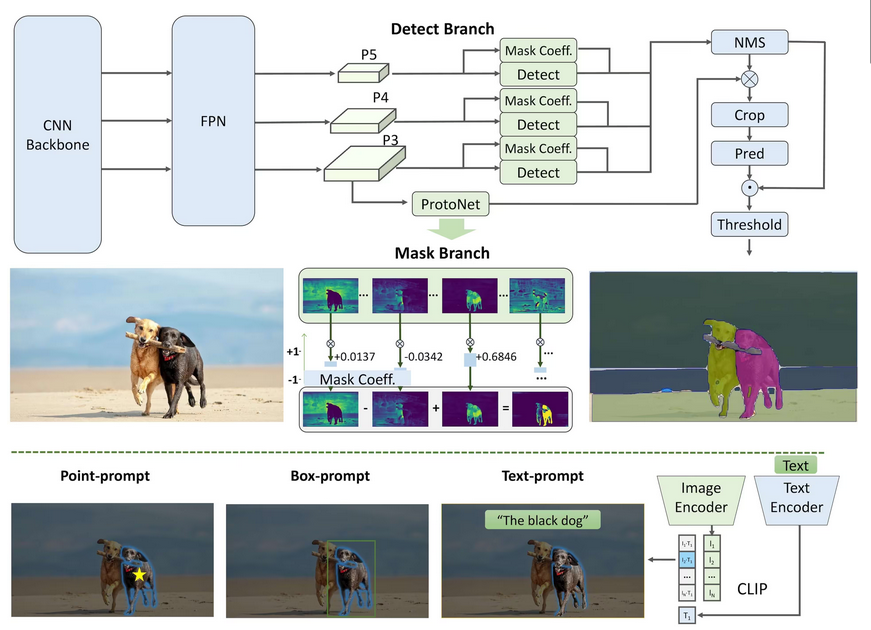
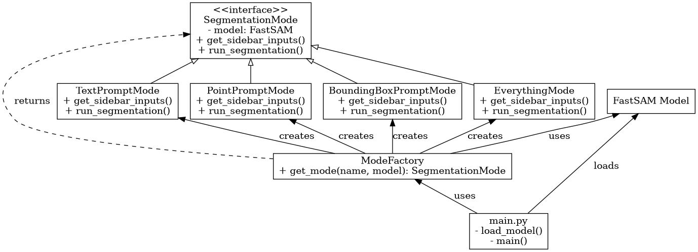

# FastSAM Streamlit Application

An interactive **Streamlit** application for image segmentation using [FastSAM](https://github.com/ultralytics/ultralytics).  
This app allows you to choose between different segmentation modes:
- **Text Prompt** – segment objects by describing them in words.
- **Point Prompt** – segment objects by specifying a point coordinate.
- **Bounding Box Prompt** – segment objects by specifying a rectangular region.
- **Everything** – segment all objects in the image.

## Features
- Upload an image in JPG or PNG format.
- Select segmentation mode from the sidebar.
- Provide prompt text, point coordinates, or bounding box coordinates.
- Run FastSAM and view segmented output directly in the browser.
- All logic is contained in a single Python file (`main.py`).


## Architecture

### Application Structure Diagram

  

### About FastSAM

FastSAM is a state-of-the-art image segmentation model developed by the Ultralytics team, designed to provide fast and accurate segmentation results on various types of images. It builds upon the Segment Anything Model (SAM) architecture, which is capable of segmenting any object in an image with minimal user input.

### Key Advantages of FastSAM:
- **Speed:** Optimized for rapid inference, making it suitable for real-time applications.
- **Versatility:** Supports multiple prompt types for segmentation:
  - **Text Prompts:** Segment objects based on natural language descriptions.
  - **Point Prompts:** Segment objects by clicking on a point inside the object.
  - **Bounding Box Prompts:** Segment objects by drawing bounding boxes.
  - **Everything Mode:** Automatically segments all objects present in the image without prompts.
- **Accuracy:** Maintains high-quality segmentation masks even on complex scenes.

### How FastSAM Works in This Application
- The user uploads an image.
- Depending on the selected mode, the user provides prompts interactively (text, points, or bounding boxes).
- FastSAM processes the image and prompts to generate segmentation masks.
- The masks are displayed in the browser overlayed on the original image.
- Users can adjust parameters such as confidence thresholds to refine the segmentation results.

This app demonstrates FastSAM’s flexibility and ease of use in an interactive web application built with Streamlit, enabling users to experiment with different segmentation strategies quickly.

### UML Class Diagram

  

---

## Requirements
- Python 3.8+
- [Streamlit](https://streamlit.io/)
- [Ultralytics](https://github.com/ultralytics/ultralytics)
- [Pillow](https://python-pillow.org/)

## Installation

1. **Clone or download this repository** and open a terminal in the project folder.

2. **Create a virtual environment**:
    ```bash
    python3 -m venv fastsam-env
    source fastsam-env/bin/activate  # Windows: fastsam-env\Scripts\activate
    ```

3. **Install dependencies**:
    ```bash
    pip install requirements.txt
    ```

4. **(Optional)** Download the FastSAM model in advance, or it will be automatically downloaded on the first run.

## Usage
Run the app with:
```bash
streamlit run main.py
